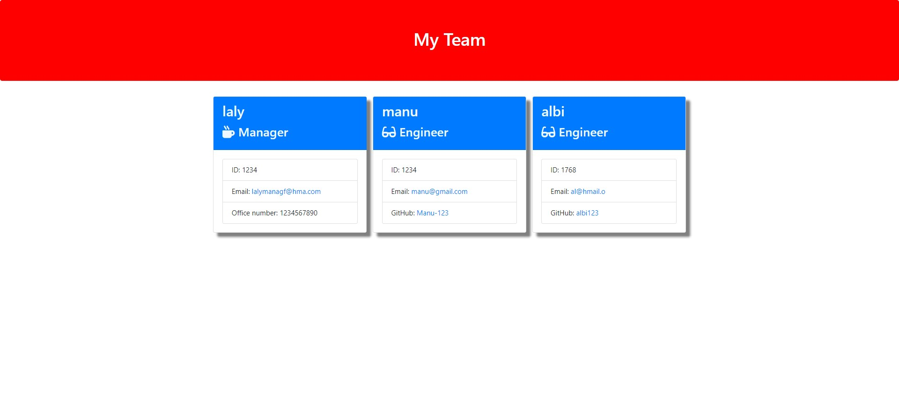

# Team Profile Generator

## Project Description

This application will take in information about employees on a software engineering team, then generates an HTML webpage that displays summaries for each person.

## Table of Contents

+ Installation
+ Usage
+ License
+ Contributing
+ Tests
+ Url
+ Output
+ Questions

## Installation

To create a Node.js project

To install the necessary dependencies here it is inquirer, run the following command:

## Usage
To run the application, use the following command:

The application will then prompt you to enter manager details and then prompt a list 
1) Add an Engineer
2) Add a Intern
3)Finished Building the team

Add necessary details of engineer or interns and build a team.if you choose finished building the team it will create an HTML file with the team profile details under the Manager

## License
This project is licensed under the MIT license.

## Contributing
Contributions to this project are welcome. If you would like to contribute, please fork the repository and submit a pull request.

## Tests
To run the tests, use the following command:

There are 17 test to be passed.Sample image for successful tests.

## URL

GitHub url: [https://github.com/LalyF/Team-Profile-Generator.git]

## Output
The landing page looks like the following:

## Questions
If you have any questions about the project, please feel free to contact me at lalymanaf2015@gmail.com. You can find more of my work at LalyF.